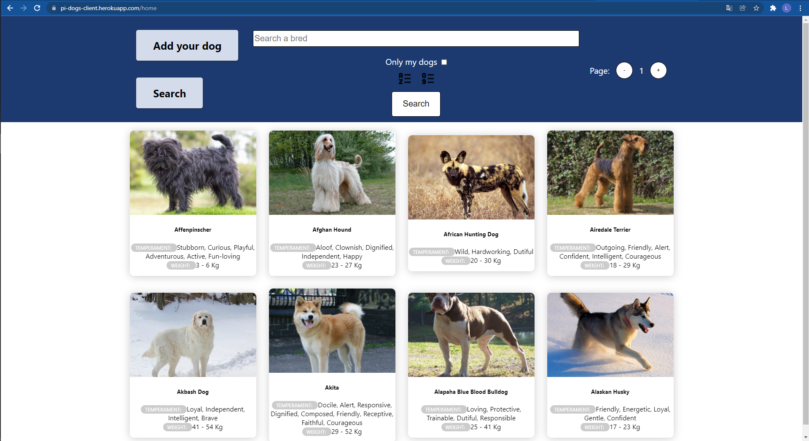
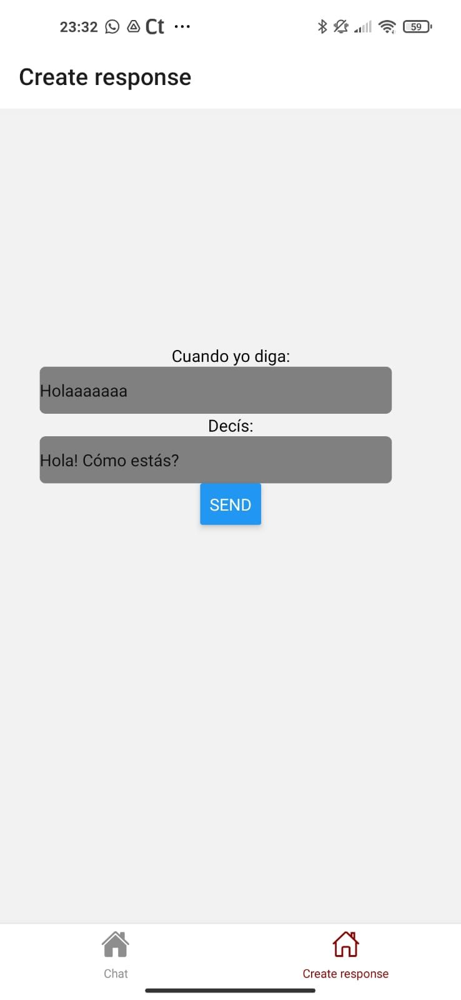
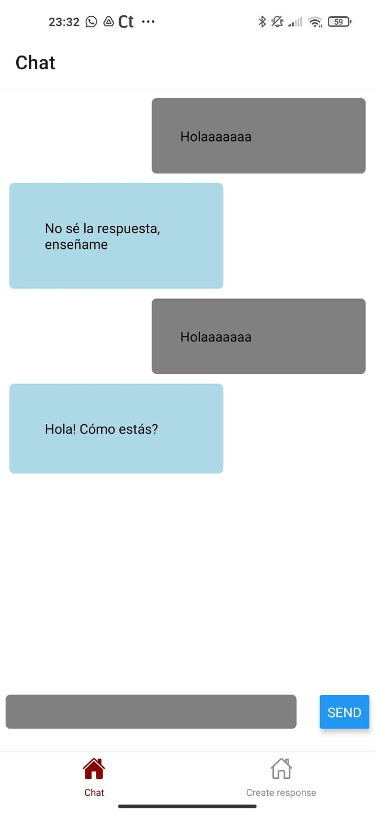

<h1> Holaaa!</h1><h2>
Soy un desarrollador web con ganas de aportar soluciones innovadoras.</h2>

<h2> Mis tecnologias</h2>
<ul>
  <li>React</li>
  <li>Redux</li>
  <li>Node.js</li>
  <li>Express.js</li>
</ul>
<h2> Mis proyectos</h2>

<h3>Dog project</h3>

<h3>Esta es una aplicación que, haciendo uso de un servidor con su respectiva base de datos; puede crear, filtrar, y ordenar razas de perros. </h3>

<h3>Chat app</h3>

<h3>A través de esta aplicación, podemos hablar y enseñarle a responder a un bot. Si bien se encuentra en desarrollo, quien así quisiera puede descargarla <a href="https://drive.google.com/file/d/1GW0nJRgGvDcNEpUsTzUcIgFcQ1r0TR07/view">aquí</a> y darme feedback! </h3>
  

 
  

  <h2>Actualmente me encuentro buscando trabajo. si estás interesado en contratarme podés hablarme por <a href="https://www.linkedin.com/in/lucas-santillan/">LinkedIn</a> o contactarme vía Mail: lukitas6641@gmail.com
  

<!--
**LucasSantillan0/LucasSantillan0** is a ✨ _special_ ✨ repository because its `README.md` (this file) appears on your GitHub profile.

Here are some ideas to get you started:

- 🔭 I’m currently working on ...
- 🌱 I’m currently learning ...
- 👯 I’m looking to collaborate on ...
- 🤔 I’m looking for help with ...
- 💬 Ask me about ...
- 📫 How to reach me: ...
- 😄 Pronouns: ...
- ⚡ Fun fact: ...
-->
